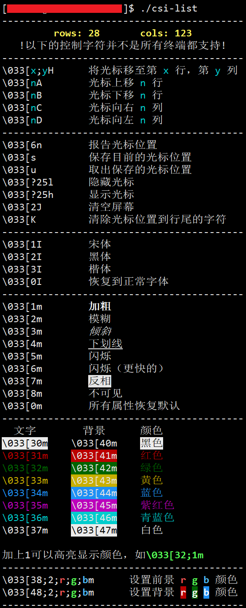

# CSI（Control Sequence Introducer）
### ascii样式控制字符速查

1. 克隆仓库

~~~bash
git clone https://github.com/AkashiNeko/CSI.git
~~~

2. 运行

~~~bash
cd CSI/
./csi-list
~~~

### 运行展示

ascii码控制的字体样式，随着终端的不同，不一定都能在终端上显示。下面是使用XShell运行该程序的截图。

在 vscode 的终端下，结果也和下图相似。

亲测在 Windows 10 的 cmd 窗口下，这些控制字符完全不起作用。

